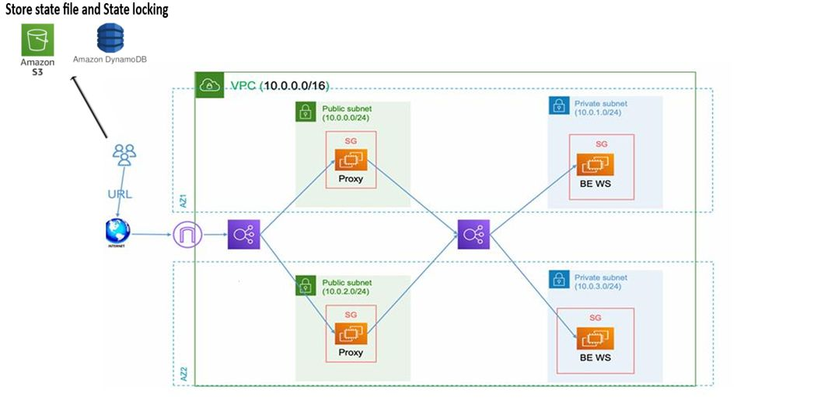
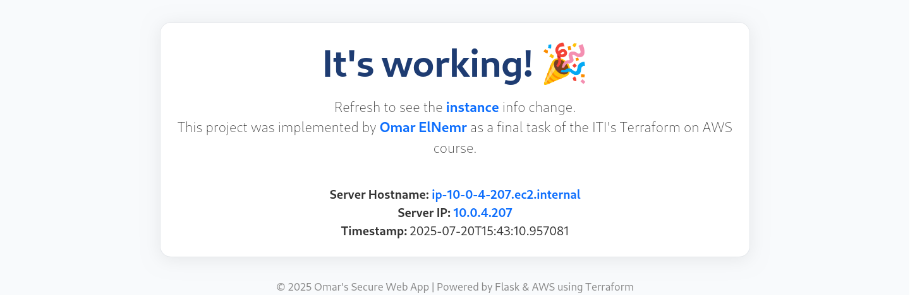
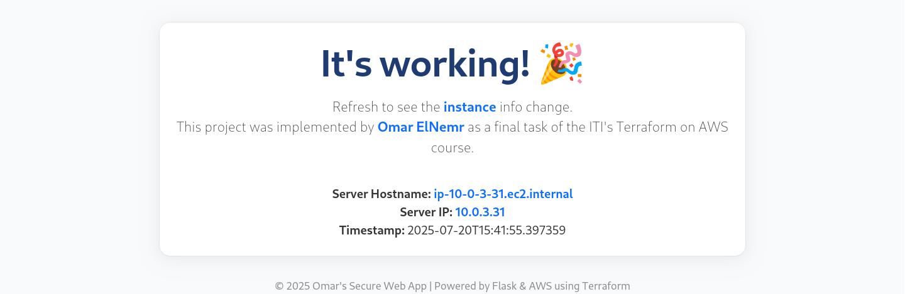

# Secure Web App with Public Proxy + Private Backend on AWS

This project demonstrates a secure, production-style web application architecture on AWS using Terraform. It features public proxy servers, private backend servers, and load balancing for high availability.

## 🏗️ Architecture Overview



```
Internet → Public ALB → Nginx Proxy (Public Subnets) → Internal ALB → Backend Apps (Private Subnets)
```

## Features
- Custom VPC with public/private subnets
- Public Nginx proxy EC2s, private Flask backend EC2s
- Public & internal ALBs for secure routing
- Security groups for strict access
- Automated deployment with Terraform modules

## 🚀 Quick Start

1. **Clone & Enter Project**
   ```bash
   git clone https://github.com/omar99elnemr/terraform-secure-webapp.git
   cd terraform-secure-webapp
   ```
2. **Configure AWS CLI & Terraform**
   - Install [AWS CLI](https://docs.aws.amazon.com/cli/latest/userguide/getting-started-install.html) & [Terraform](https://developer.hashicorp.com/terraform/downloads)
   - Run `aws configure` and set up your credentials
3. **Prepare Backend for State**
   ```bash
   cd backend-setup
   terraform init && terraform apply
   # Copy S3 bucket and DynamoDB table outputs to ../terraform.tf
   ```
4. **Set Variables**
   ```bash
   cd ..
   cp terraform.tfvars.example terraform.tfvars
   # Edit terraform.tfvars with your key_name and private_key_path
   ```
5. **Deploy Infrastructure**
   ```bash
   terraform init
   terraform workspace new dev
   terraform apply
   ```
6. **Access the App**
   - Get the public ALB DNS from Terraform outputs
   - Open in your browser: `http://<public-alb-dns>`

## 📸 Verification

Below are screenshots showing the deployed backend and load balancer in action:

| App Homepage Example | Load Balancer Verification |
|---------------------|---------------------------|
|  |  |

## 📝 Project Structure

```
terraform-secure-webapp/
├── backend-app/         # Flask backend app
├── backend-setup/      # Terraform backend config
├── imgs/               # Architecture & verification images
├── modules/            # Terraform modules (vpc, ec2, lb, sg)
├── scripts/            # Nginx/Python install scripts
├── main.tf, variables.tf, outputs.tf, terraform.tf, terraform.tfvars.example
└── README.md
```

## 🧩 Notes
- The app homepage shows which backend instance handled your request—refresh to see load balancing in action.
- This project was implemented by **Omar ElNemr** as a final task of the ITI's Terraform on AWS course.

---

© 2025 Omar's Secure Web App | Powered by Flask & AWS using Terraform