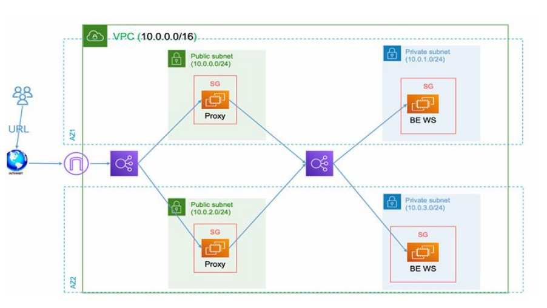

# Secure Web App with Public Proxy + Private Backend on AWS

This project demonstrates a secure web application architecture deployed on AWS using Terraform. The infrastructure includes public proxy servers and private backend servers with load balancing and high availability.

## Architecture Overview


```
Internet → Public ALB → Nginx Proxy (Public Subnets) → Internal ALB → Backend Apps (Private Subnets)
```

### Components
- **VPC**: Custom VPC with public and private subnets across 2 AZs
- **Public Subnets**: Host Nginx reverse proxy servers
- **Private Subnets**: Host backend application servers
- **NAT Gateway**: Provides internet access for private subnets
- **Application Load Balancers**: Public ALB for external traffic, Internal ALB for backend routing
- **Security Groups**: Network-level security controls
- **EC2 Instances**: Proxy and backend servers

## 📋 Prerequisites

Before you begin, ensure you have the following installed and configured:

### 1. AWS CLI
Install and configure AWS CLI with your credentials:
```bash
# Install AWS CLI (if not already installed)
curl "https://awscli.amazonaws.com/awscli-exe-linux-x86_64.zip" -o "awscliv2.zip"
unzip awscliv2.zip
sudo ./aws/install

# Configure AWS CLI
aws configure
# Enter your AWS Access Key ID
# Enter your AWS Secret Access Key
# Enter your default region (e.g., us-east-1)
# Enter default output format (json)
```

### 2. Terraform
Install Terraform (version 1.0+):
```bash
# Download and install Terraform
wget https://releases.hashicorp.com/terraform/1.6.0/terraform_1.6.0_linux_amd64.zip
unzip terraform_1.6.0_linux_amd64.zip
sudo mv terraform /usr/local/bin/
terraform --version
```

### 3. AWS Key Pair
Create an AWS EC2 Key Pair for SSH access:
```bash
# Create key pair using AWS CLI
aws ec2 create-key-pair --key-name my-terraform-key --query 'KeyMaterial' --output text > my-terraform-key.pem

# Set proper permissions
chmod 400 my-terraform-key.pem
```

**Note**: AWS key pair creation and S3 bucket setup are included in the deployment process.

## 🚀 Step-by-Step Deployment Guide

### Step 1: Clone the Repository
```bash
git clone https://github.com/omar99elnemr/terraform-secure-webapp.git
cd terraform-secure-webapp
```

### Step 2: Set up Terraform Backend
Create an S3 bucket for state storage:
```bash
# Navigate to backend setup directory
cd backend-setup

# Initialize and apply
terraform init
terraform apply

# Note the outputs - you'll need these values
```

### Step 3: Update Main Project and Migrate
Update your main `terraform.tf` with the output values:

```hcl
# terraform.tf (update with actual values from backend-setup outputs)
terraform {
  required_version = ">= 1.0"
  required_providers {
    aws = {
      source  = "hashicorp/aws"
      version = "~> 5.0"
    }
  }
  
  backend "s3" {
    bucket         = "secure-webapp-terraform-state-a1b2c3d4e5f6g7h8"  # From output
    key            = "dev/terraform.tfstate"
    region         = "us-east-1"
    encrypt        = true
    dynamodb_table = "secure-webapp-terraform-locks"  # From output
  }
}
```

### Step 4: Configure Variables
```bash
cd ..
# Copy the example file and customize it
cp terraform.tfvars.example terraform.tfvars

# Edit terraform.tfvars with your specific values
vim terraform.tfvars
```

**Example terraform.tfvars.example content:**
```hcl
# AWS Configuration
aws_region = "us-east-1"
project_name = "secure-webapp"

# Network Configuration
vpc_cidr = "10.0.0.0/16"

# Availability Zones and Subnets
availability_zones = ["us-east-1a", "us-east-1b"]
public_subnet_cidrs = ["10.0.1.0/24", "10.0.2.0/24"]
private_subnet_cidrs = ["10.0.3.0/24", "10.0.4.0/24"]

# Instance Configuration
instance_type = "t3.micro"

# CHANGE THESE TO YOUR VALUES
key_name = "your-aws-key-pair-name"
private_key_path = "/path/to/your/private/key.pem"
```

### Step 5: Initialize and Create Workspace
```bash

terraform init
terraform workspace new dev
terraform workspace select dev
```

### Step 6: Deploy Infrastructure
```bash
terraform plan
terraform apply
```

### Step 7: Access the Application
- Get the public load balancer DNS from outputs
- Access via browser: `http://<public-alb-dns>`

## Project Structure

```
terraform-secure-webapp/
├── README.md
├── main.tf                 # Main Terraform configuration
├── variables.tf            # Variable definitions
├── outputs.tf              # Output definitions
├── terraform.tf            # Backend and provider configuration
├── terraform.tfvars.example # Example variables file
├── modules/
│   ├── vpc/               # VPC module
│   │   ├── main.tf
│   │   ├── variables.tf
│   │   └── outputs.tf
│   ├── security-groups/   # Security groups module
│   │   ├── main.tf
│   │   ├── variables.tf
│   │   └── outputs.tf
│   ├── ec2/              # EC2 instances module
│   │   ├── main.tf
│   │   ├── variables.tf
│   │   └── outputs.tf
│   └── load-balancer/    # Load balancer module
│       ├── main.tf
│       ├── variables.tf
│       └── outputs.tf
├── backend-app/
│   ├── app.py            # Flask backend application
│   └── requirements.txt  # Python dependencies
├── backend-setup/         # Terraform backend setup
│   ├── main.tf
│   ├── variables.tf
│   └── outputs.tf
└── scripts/
    ├── install-nginx.sh   # Nginx installation script
    └── install-python.sh  # Python installation script
```

## Key Features

### Infrastructure as Code
- **Modular Design**: Custom Terraform modules for reusability
- **Remote State**: S3 backend with state locking
- **Workspaces**: Separate environments (dev, staging, prod)

### Security
- **Network Isolation**: Private subnets for backend servers
- **Security Groups**: Least privilege access controls
- **NAT Gateway**: Secure internet access for private instances

### High Availability
- **Multi-AZ Deployment**: Resources across multiple availability zones
- **Load Balancing**: Application Load Balancers for traffic distribution
- **Auto Scaling Ready**: Infrastructure prepared for auto scaling groups

### Automation
- **Provisioners**: Automated software installation and configuration
- **File Deployment**: Automated application deployment to backend servers
- **IP Logging**: Automatic generation of IP address inventory

## Deployment Details

### 1. VPC and Networking
- Custom VPC with DNS resolution enabled
- Public subnets with auto-assign public IPs
- Private subnets with NAT gateway routing
- Internet Gateway for public access

### 2. Security Groups
- **Proxy SG**: Allows HTTP/HTTPS from internet, SSH access
- **Backend SG**: Allows Flask app port (5000) from proxy SG only
- **ALB SGs**: Appropriate ingress rules for load balancers

### 3. EC2 Instances
- **Proxy Instances**: Nginx reverse proxy in public subnets
- **Backend Instances**: Flask application in private subnets
- **User Data**: Automated software installation via scripts

### 4. Load Balancers
- **Public ALB**: Internet-facing, routes to proxy instances
- **Internal ALB**: Internal, routes from proxy to backend instances
- **Health Checks**: Automated health monitoring

## Testing the Deployment

1. **Check IP addresses**
   ```bash
   cat all-ips.txt
   ```

2. **Test public access**
   ```bash
   curl http://<public-alb-dns>
   ```

3. **Verify backend response**
   - The response should include backend server hostname
   - Multiple requests should show different backend servers (load balancing)

## Monitoring and Logs

- **CloudWatch**: Automatic monitoring for all AWS resources
- **ALB Access Logs**: Can be enabled in load balancer configuration
- **Application Logs**: Available on EC2 instances

## Cost Optimization

- **Instance Types**: Uses t3.micro for cost-effectiveness
- **Single NAT Gateway**: Shared across AZs (can be scaled for HA)
- **Termination Protection**: Disabled for easy cleanup

## Cleanup

To destroy the infrastructure:
```bash
terraform destroy
```

## Security Considerations

1. **Network Security**: Private subnets isolate backend servers
2. **Access Control**: Security groups implement least privilege
3. **SSH Access**: Bastion host pattern for private instance access
4. **Secrets Management**: Use AWS Secrets Manager for sensitive data

## Troubleshooting

### Common Issues

1. **Key Pair**: Ensure your AWS key pair exists in the specified region
2. **Permissions**: Verify AWS credentials have necessary permissions
3. **State Lock**: If state is locked, check DynamoDB for lock entries
4. **Health Checks**: Ensure health check endpoints are accessible

### Debug Commands

```bash
# Check Terraform state
terraform state list

# View specific resource
terraform state show aws_instance.proxy

# Check workspace
terraform workspace show

# Validate configuration
terraform validate
```

## Contributing

1. Fork the repository
2. Create a feature branch
3. Make your changes
4. Test thoroughly
5. Submit a pull request

## License

This project is licensed under the MIT License - see the LICENSE file for details.